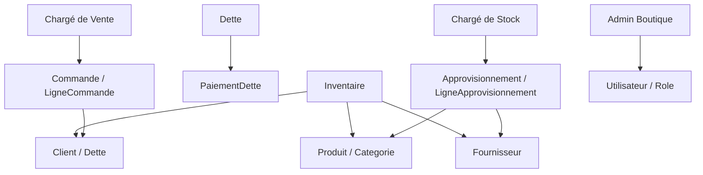

# Dossier de Conception UML - StoreManager Pro ERP

*** NDEYE AISSATOU SENE P8 ***

---

## 1. Présentation des 4 Profils Utilisateurs (Diagrammes Use Case)

L'application découpe les responsabilités selon **4 rôles métier** et leurs vues autorisées :

- **Admin Boutique** : `docs/usecase_admin.puml` — Contrôle total : Tableau de bord (KPIs financiers, dernières ventes, dettes critiques), Caisse POS, Dettes, Approvisionnements et Catalogue.

- **Chargé de Vente** : `docs/usecase_vendeur.puml` — Accès restreint à la caisse tactile POS (recherche produit, constitution panier, sélection client, choix mode paiement, validation vente) et au suivi des dettes (enregistrement des versements).

- **Chargé de Stock** : `docs/usecase_stock.puml` — Gestion des approvisionnements (réception de Bons de Livraison BL) et consultation du catalogue produits (alertes stock critique) et fournisseurs.

- **Inventaire** : `docs/usecase_inventaire.puml` — Accès à l'écran Catalogue pour la consultation et le comptage des stocks, ainsi que la gestion des fiches clients et fournisseurs.

- **Diagramme Global** : `docs/usecase.puml` — Vue d'ensemble récapitulative des cas d'utilisation et des permissions par profil.

---

## 2. Diagramme de Classes POO (`docs/class_diagram.puml`)

### Architecture & Modélisation des Entités
Le modèle métier POO s'articule autour des entités suivantes :

- `Role` : Énumération des rôles système (`ADMIN`, `VENTE`, `STOCK`, `INVENTAIRE`).

- `Utilisateur` : Gestion du compte utilisateur, authentification et contrôle des permissions.

- `Client` : Gestion des coordonnées, du solde de dette cumulé et du plafond de crédit.

- `Fournisseur` : Partenaire approvisionneur (coordonnées et suivi).

- `Produit` & `Categorie` : Catalogue d'articles avec seuil d'alerte et ajustement de stock.

- `Commande` & `LigneCommande` : Transactions de vente en caisse POS (composition 1 vers N).

- `Dette` & `PaiementDette` : Suivi financier des impayés avec versements partiels.

- `Approvisionnement` & `LigneApprovisionnement` : Réceptions des Bons de Livraison fournisseurs avec incrémentation automatique du stock.

---

## 3. Matrice de Traçabilité Use Cases vs Entités

